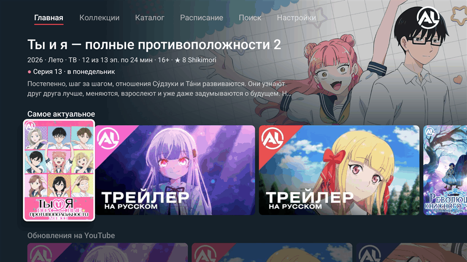
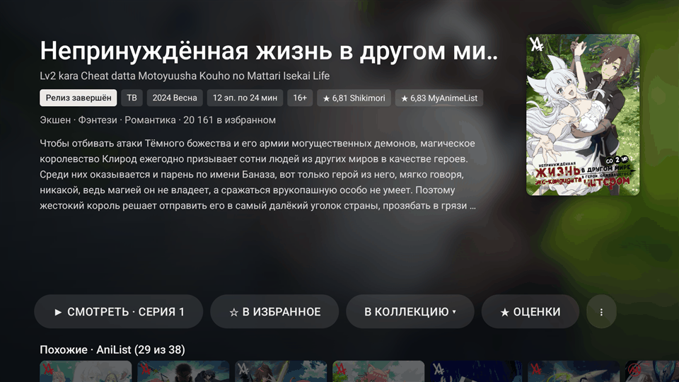

# AniLiberty (ex AniLibria)

> **Это форк [anilibria/anilibria-app](https://github.com/anilibria/anilibria-app) для Android TV.**
> Новый интерфейс (вкладки, hero-шапка, экран релиза), Compose-плеер с HLS-кэшем, «Продолжить просмотр» (в том числе системный ряд Watch Next), API V1 и двусторонняя синхронизация с AniList.
> Готовые сборки и полный список отличий от оригинала — в [Releases](https://github.com/TOSHIK13/anilibria-app/releases).
> Приложение обновляется из `check-tv.json` этого форка. Развивается только `app-tv`; мобильное приложение — как в оригинале.

<p>
  
  
</p>
Клиент для [aniliberty.top](https://aniliberty.top/)

Мобильное приложение: [RuStore](https://www.rustore.ru/catalog/app/ru.radiationx.anilibria.app) | [Releases](https://github.com/anilibria/anilibria-app/releases?q=version)

Android TV приложение: [RuStore](https://www.rustore.ru/catalog/app/ru.radiationx.anilibria.app.tv) | [Releases](https://github.com/anilibria/anilibria-app/releases?q=tv)

## Сборка для разработки

Debug-сборка не требует приватных ключей подписи:

```shell
./gradlew :media-mobile:assembleDebug :app-mobile:assembleDebug :app-tv:assembleDebug
```

# Лицензия #
Исходный код распостраняется под лицензией GPL v3

> Copyright (C) 2017-2024  Evgeniy Nizamiev [(radiationx@yandex.ru)](mailto:radiationx@yandex.ru)
> 
> This program is free software; you can redistribute it and/or modify
> it under the terms of the GNU General Public License as published by
> the Free Software Foundation; either version 3 of the License.
